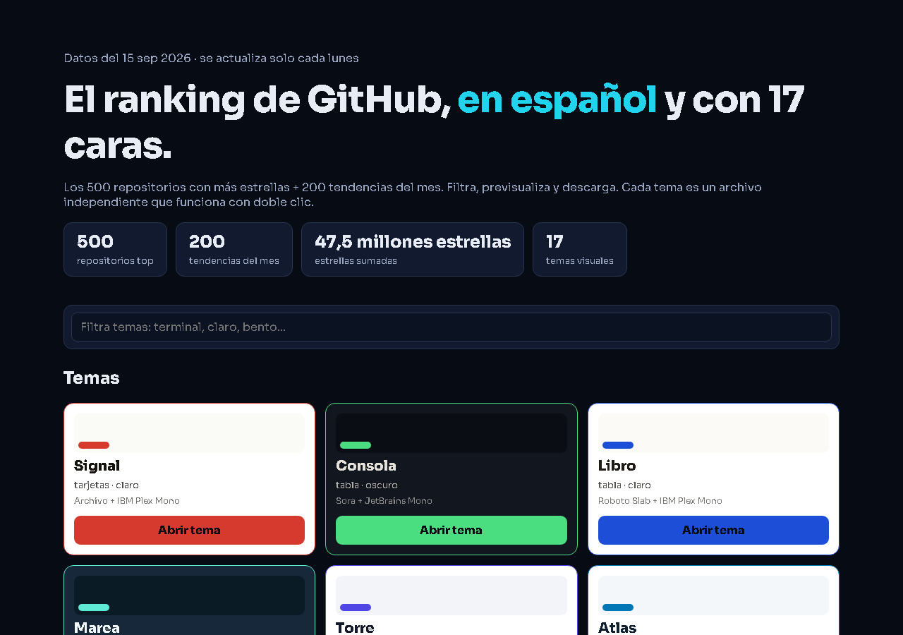
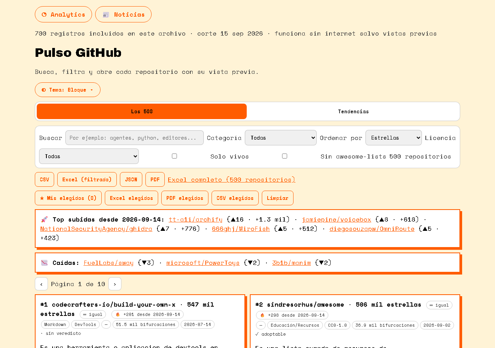
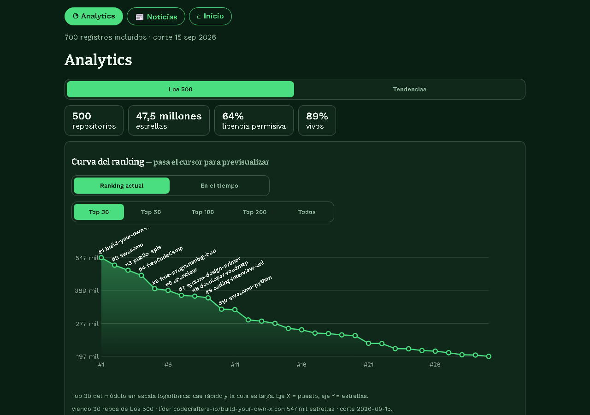
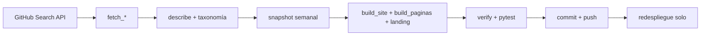

<p align="center">
  <h1 align="center">📊 Pulso GitHub</h1>
  <p align="center"><strong>El ranking de GitHub, en español y con 17 caras.</strong><br>500 repos con más estrellas + 200 tendencias. Filtra, previsualiza y descarga.</p>
  <p align="center">
    <a href="https://github.com/Marusan94/pulso-github/actions/workflows/refresh.yml"></a>
    
    
    
    
  </p>
</p>

| Portada | Tema Bloque | Analytics |
|---|---|---|
|  |  |  |

## ✨ Qué hace

- 🔍 **Dos módulos**: Los 500 + Tendencias (30 días), con buscador, categoría, licencia, fecha exacta o rangos y 4 ordenamientos.
- 📈 **Dinámica real**: flechas ▲▼ de puestos, rachas 🔥, Top subidas/caídas y vista "En el tiempo" desde el segundo corte.
- 📊 **Analytics**: curva logarítmica con etiquetas, radar por categoría, líderes de crecimiento (CSV), histograma y serie por repo al clic.
- 📰 **Noticias** generadas de los datos: hitos, recién llegados y rachas.
- 🎨 **17 temas** que te siguen a todas las vistas (`?tema=`), con contraste validado.
- ⬇️ **Descargas**: CSV, Excel, JSON y PDF. **Mis elegidos** ☆ guardados en tu navegador.
- 🔒 **Privacidad**: cero cookies en local; analytics open source (Umami) solo en producción.

## 🚀 Uso en local

```bash
# Opción 1: doble clic en cualquier HTML de docs/
# Opción 2 (recomendada): servidor local
cd docs && python -m http.server 8901
# o doble clic en ver.bat → http://localhost:8901/29-evergreen.html
```

## 🔄 Cómo se actualiza solo



Cada lunes 06:00 UTC (o manual en Actions → Run workflow). Fechas, ventanas y textos de corte se derivan de los datos: nada hardcodeado. Con `GITHUB_TOKEN` la API va autenticada.

## 🗂️ Estructura

```
├── data/               # repos.json (500) + trending.json (200) + history/
├── docs/               # sitio publicable (17 temas + analytics + noticias + xlsx)
├── src/ranking/        # lógica compartida: taxonomia, historial, fechas
├── scripts/            # fetch → describe → snapshot → excel → builds → verify
├── tests/              # 8 E2E en Chromium real (Playwright)
└── .github/workflows/refresh.yml
```

## ⚙️ Variables de entorno (opcionales)

| Variable | Dónde | Efecto |
|---|---|---|
| `GITHUB_TOKEN` | Actions (automático) | API autenticada, sin rate-limits |
| `SITE_URL` | Actions vars / proveedor | sitemap, canonical y OG con tu dominio |
| `UMAMI_URL` + `UMAMI_ID` | Actions secrets/vars | tracker sin cookies solo en producción |

Sin ellas todo funciona igual, sin tracker ni canonicals.

## 🧪 Calidad

```bash
pip install -r requirements.txt
pip install pytest playwright && python -m playwright install chromium
python scripts/verify.py   # datos + JS (node) + tracker + contraste WCAG
python -m pytest tests -q  # 8 E2E en Chromium
```

Metodología, sesgos y licencia de datos: [`docs/como-esta-hecho.html`](docs/como-esta-hecho.html).

## 📄 Licencia

MIT. Datos: API pública de GitHub (corte incluido en cada archivo); descripciones y taxonomía, propias.
