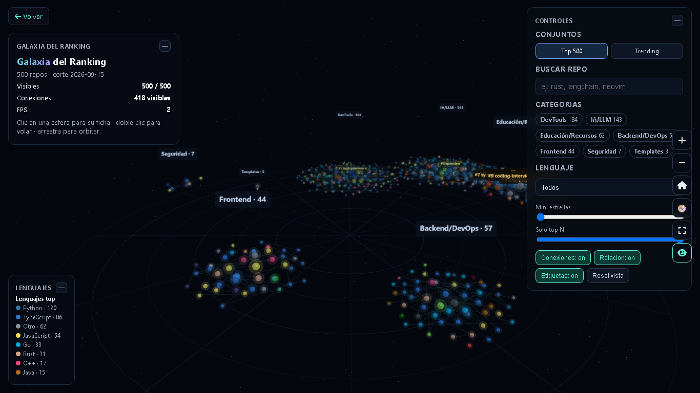
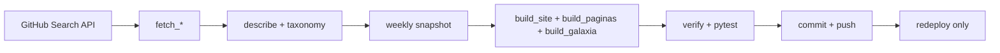

<p align="center">
  <h1 align="center">📊 Pulso GitHub</h1>
  <p align="center"><strong>The GitHub ranking, in clear Spanish, with 17 faces.</strong><br>500 most-starred repos + 200 trending. Filter, preview, download, and explore in 3D.<br><a href="https://marusan94.github.io/pulso-github/"><strong>🌐 Live → marusan94.github.io/pulso-github</strong></a></p>
  <p align="center">
    <a href="https://github.com/Marusan94/pulso-github/actions/workflows/refresh.yml"></a>
    
    
    
    
    
  </p>
</p>

## 🧭 El proyecto en breve

**Pipeline de datos que se publica solo**

- **Problema:** Nadie mantiene un ranking del open source en español.
- **Automatización:** GitHub Actions lee la API, rankea 500 repos y publica la web sin intervención.
- **Resultado:** Ranking vivo en español, actualizado solo.

`Python` · `GitHub Actions` · `GitHub API` — [Demo →](https://marusan94.github.io/pulso-github) · [Código →](https://github.com/Marusan94/pulso-github)

## Table of Contents

- [Screenshots](#-screenshots)
- [Features](#-features)
- [Quickstart](#-quickstart)
- [How It Updates](#-how-it-updates)
- [Usage](#-usage)
- [Structure](#️-structure)
- [Configuration](#️-configuration)
- [Quality](#-quality)
- [Contributing](#-contributing)
- [License](#-license)

## 📸 Screenshots

| Home (Console theme) | Analytics | News | 3D Galaxy |
|---|---|---|---|
|  |  |  |  |

## ✨ Features

- 🔍 **Two modules**: Top 500 + Trending (30 days), with search, category, license, exact-date or range filters, 4 sort orders
- 📈 **Real momentum**: rank arrows ▲▼, streaks 🔥, top risers/fallers, “Over time” view from the second snapshot on
- 📊 **Analytics**: log-scale curve with labels, radar by category, growth leaders (CSV), histogram, per-repo series on click
- 📰 **Data-driven news**: milestones, newcomers, streaks — generated from the data
- 🌌 **3D Galaxy** (`docs/galaxia.html`): 500 + 200 trending as constellations by category, size by stars, color by language. Click for cards + camera fly, hover labels, similar-repo links, search + filters. Zero backend: static HTML with embedded data
- 🇪🇸 **Clear Spanish descriptions**: synthetic translation of what each repo does + minimal card, no generic filler
- 🎨 **17 themes** across every view (`?tema=`), contrast-checked. Default entry: Console theme
- ⬇️ **Downloads**: CSV, Excel, JSON, PDF. **My picks** ☆ saved in your browser
- 🔒 **Privacy**: zero cookies locally; open-source analytics (Umami) only in production

## 🚀 Quickstart

```bash
# Option 1: double-click any HTML in docs/ (galaxia.html needs internet only for the Three.js CDN)
# Option 2 (recommended): local server
cd docs && python -m http.server 8901
# or double-click ver.bat → http://localhost:8901/02-midnight-console.html
```

## 🔄 How It Updates


```mermaid
flowchart LR
    API[GitHub Search API] --> FETCH[fetch_*]
    FETCH --> DESC[describe + taxonomy]
    DESC --> SNAP[weekly snapshot]
    SNAP --> BUILD[build_site + build_paginas + build_galaxia]
    BUILD --> CHECK[verify + pytest]
    CHECK --> PUSH[commit + push]
    PUSH --> DEPLOY[redeploy only]
```

Every Monday 06:00 UTC (or manual via Actions → Run workflow). Cutoff dates, windows, and labels derive from the data — nothing hardcoded. With `GITHUB_TOKEN` the API runs authenticated.

## 💡 Usage

- **Explore**: open the live site → filter by category/license → sort by stars/growth → click a repo for its card.
- **Time travel**: open “En el tiempo” after week 2 to see rank curves.
- **Galaxy**: open `docs/galaxia.html` → search → filter by language → click a star for camera fly-to.
- **Download**: export CSV/Excel/JSON/PDF from any view; ☆ picks persist in `localStorage`.

## 🗂️ Structure

```
├── data/               # repos.json (500) + trending.json (200) + history/
├── docs/               # publishable site (17 themes + analytics + news + galaxy + xlsx)
├── src/ranking/        # shared logic: taxonomy, history, dates
├── scripts/            # fetch → describe → snapshot → excel → builds → verify (incl. build_galaxia.py)
├── tests/              # 8 E2E in real Chromium (Playwright)
└── .github/workflows/refresh.yml
```

## ⚙️ Configuration

| Variable | Where | Effect |
|---|---|---|
| `GITHUB_TOKEN` | Actions (automatic) | Authenticated API, no rate limits |
| `SITE_URL` | Actions vars / provider | Sitemap, canonical, OG with your domain |
| `UMAMI_URL` + `UMAMI_ID` | Actions secrets/vars | Cookieless tracker only in production |

Without them everything works — no tracker, no canonicals.

Methodology, bias notes, and data license: [`docs/como-esta-hecho.html`](docs/como-esta-hecho.html).

## 🧪 Quality

```bash
pip install -r requirements.txt
pip install pytest playwright && python -m playwright install chromium
python scripts/verify.py   # data + JS (node) + tracker + WCAG contrast
python -m pytest tests -q  # 8 E2E in Chromium
```

## 🤝 Contributing

Fork → branch → `python scripts/verify.py` + `pytest -q` → PR. For taxonomy changes, include before/after counts.

## 📄 License

MIT. Data: public GitHub API (snapshot bundled per file); descriptions and taxonomy are original.

---

<p align="center">Built by <a href="https://github.com/Marusan94">@Marusan94</a> · Updated every Monday 06:00 UTC</p>
